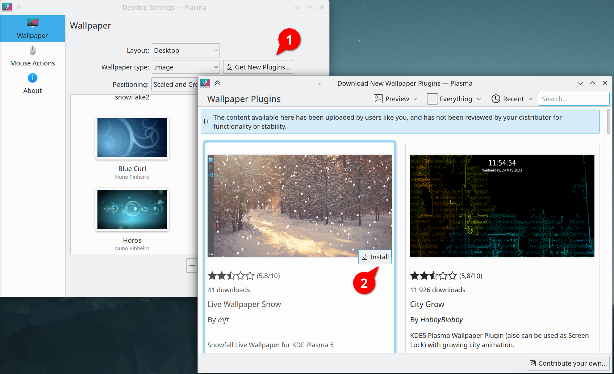

## It looks like this

**Youtube video**

[](https://www.youtube.com/watch?v=uj8VSp3dTjU)

## How to install

### KDE Store

It can be installed through the desktop settings. 



[KDE Store plugin link](https://store.kde.org/p/2151253/)

### Manually

1. Download and copy snow folder into your home plasma wallpapers.
```bash
wget https://github.com/IvanSafonov/plasma-wallpaper-snow/archive/refs/heads/master.zip
unzip ./master.zip
mkdir -p ~/.local/share/plasma/wallpapers/
cp -r ./plasma-wallpaper-snow-master/snow ~/.local/share/plasma/wallpapers/org.kde.snow
```

2. Open desktop and wallpaper settings and select the new wallpaper type `Snow`. If the settings were open already, you will need to close it first.
